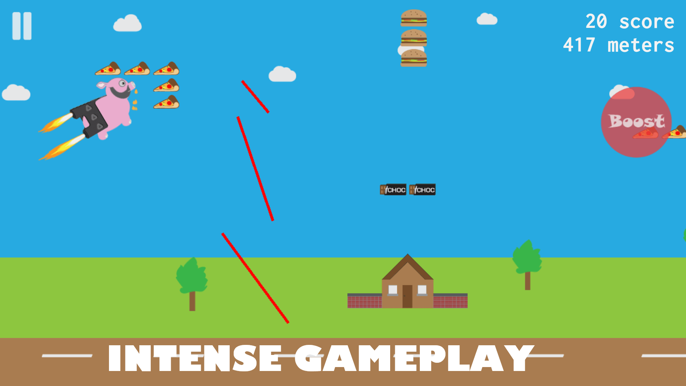

# LaserPig the online game

LaserPig is all about Timmy. Timmy’s mission is to fly to the limit and collect his snacks.  
**Developed using the Phaser game framework (http://phaser.io/).**

    

LaserPig is a challenging and exciting arcade flying game. You play as Timmy the pig flying with his jet packs avoiding lethal lasers while trying to collect his favorite snacks including burgers, pizzas and more! Fly far and collect as much as possible!  
UNLOCK difficulty levels and high powered jet packs by getting high scores and earning Credits in your Piggy Bank!
Dodge Lasers through near-impossible gaps and try get past the rotating lasers!

    

    

---

### How to play:
- Tap LEFT side of screen to go up.
- Tap RIGHT side of screen to go down.
- Tap the Boost button for extra speed and points.

### Features:
- Unlock Levels and jet packs by earning credits.
- Fun 2D graphics with blissful scenery.
- Challenging and exciting gameplay.
- Great soundtrack and sound effects.
- Physical Keyboard arrow-key support.
- 3 difficulty levels and free fly mode.
- Detailed score statistics in "My Scores" section.

---

## Contributors
- Lorenzo Lottering (https://github.com/lorenzolottering)
- Scott Grant
- James de Klerk (https://github.com/jamesdeklerk)

Lorenzo, Scott and I developed LaserPig as a project for GameNamiX (a division of Kiranamix)